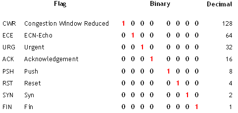

# 05. TCP Flags

TCP 헤더의 Flag(제어 비트)는 8bit로 구성되며, 각 비트가 통신 제어 신호를 의미합니다.
각 Flag는 자신의 비트 위치에 따라 고유한 Decimal(10진) 값을 갖습니다.

| Flag | 이름 | Binary | Decimal | 의미 |
| --- | --- | --- | --- | --- |
| CWR | Congestion Window Reduced | `1000 0000` | 128 | 혼잡 윈도우 감소 |
| ECE | ECN-Echo | `0100 0000` | 64 | 혼잡 알림 |
| URG | Urgent | `0010 0000` | 32 | 긴급 데이터 |
| ACK | Acknowledgement | `0001 0000` | 16 | 응답(확인) |
| PSH | Push | `0000 1000` | 8 | 즉시 전달 |
| RST | Reset | `0000 0100` | 4 | 연결 강제 종료 |
| SYN | Syn | `0000 0010` | 2 | 연결 요청(동기화) |
| FIN | Fin | `0000 0001` | 1 | 연결 종료 |

> 💡 여러 Flag가 동시에 설정될 수 있습니다.
> 예) SYN + ACK = `0001 0010` = **18** (3-Way Handshake 2단계)

---

