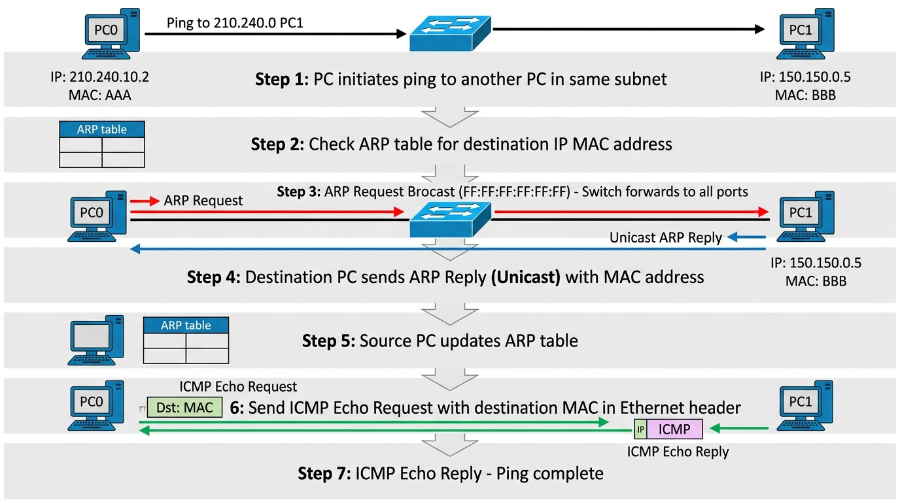

# 06. ARP / ICMP

## ARP (Address Resolution Protocol)

통신하려는 목적지 IP는 알지만, 물리적인 목적지 장비(또는 게이트웨이)의
MAC 주소를 모를 때 사용합니다.

- **ARP Request** : "이 IP 가진 사람 누구야? MAC 주소 알려줘!" (Broadcast)
- **ARP Reply** : "그 IP 내 거야, 내 MAC 주소는 이거야." (Unicast)

## ICMP (Internet Control Message Protocol)

네트워크 계층에서 IP 패킷 전송 중 발생하는 에러 보고 및 진단을 담당합니다.
대표 유틸리티가 `ping`입니다.

- Ping 요청 : `Echo Request (Type 8)`
- Ping 응답 : `Echo Reply (Type 0)`

---

## ping 동작과 ARP 흐름



```
1) PC가 같은 대역의 다른 PC로 ping 시도
        ▼
2) ARP Table에서 목적지 IP에 대응하는 MAC이 있는지 검사
        ▼
3) 없으면 ARP Request를 Broadcast(FF:FF:FF:FF:FF:FF)로 전송 → Switch는 전체 포트로 전달
        ▼
4) 목적지 PC가 ARP Reply(Unicast)로 자신의 MAC을 알려줌
        ▼
5) 송신 PC는 ARP Table 갱신
        ▼
6) Ethernet 헤더에 목적지 MAC을 넣고 ICMP Echo Request를 전송
        ▼
7) 수신 PC가 ICMP Echo Reply 반환 → ping 완료

```

| 메시지 | 설명 |
| --- | --- |
| ARP Request | 목적지 IP의 MAC을 묻는 Broadcast |
| ARP Reply | 목적지 장비가 자신의 MAC을 알려주는 Unicast |
| ICMP Request | Echo Request (Type 8) |
| ICMP Reply | Echo Reply (Type 0) |

---

[](../05_tcp-flags/tcp-flags.md)
[](../07_tcp-handshake/tcp-handshake.md)
