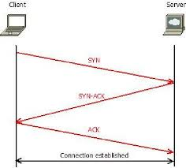
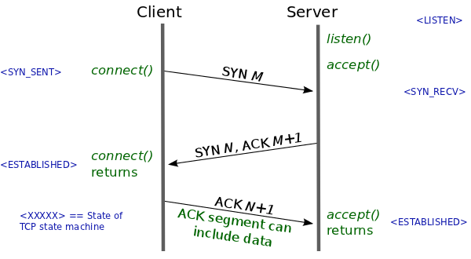

# 07. TCP 3-Way Handshake

TCP는 데이터를 전송하기 전에 **연결을 먼저 수립**하는 연결 지향 프로토콜입니다.
이 과정을 3단계로 진행하기 때문에 **3-Way Handshake**라고 부릅니다.



## 동작 단계

```
Client                                Server
  │                                      │  listen() / accept()
  │ ──────────── SYN ───────────────────▶│   (seq = 0)
  │ ◀──────── SYN, ACK ──────────────────│   (seq = 0, ack = 1)
  │ ──────────── ACK ───────────────────▶│   (seq = 1, ack = 1)
  │ ===== Connection Established =====   │
```

| 단계 | 방향 | Flag | 설명 |
| --- | --- | --- | --- |
| 1 | Client → Server | SYN | 연결 요청 (seq=0) |
| 2 | Server → Client | SYN, ACK | 요청 수락 + 응답 (seq=0, ack=1) |
| 3 | Client → Server | ACK | 응답 확인, 연결 완료 (seq=1, ack=1) |



### TCP 상태 변화

```
Client                          Server
LISTEN  ─────────────────────▶  (서버 대기)
SYN_SENT ── SYN ─────────────▶  SYN_RECV
ESTABLISHED ◀─ SYN,ACK ───────
            ── ACK ───────────▶  ESTABLISHED
```

---

## 실제 패킷 분석 예시

```
[ 환경 ]
PC IP       : 192.168.2.60      PC MAC      : 28-95-29-2C-60-19
Gateway IP  : 192.168.2.122     Gateway MAC : 88-36-6c-9f-05-e8
Web Server  : 200.20.2.2

# 1) PC → Web Server  (SYN)
Ethernet  SA 28-95-29-2C-60-19   DA 88-36-6c-9f-05-e8
IP        SA 192.168.2.60        DA 200.20.2.2
TCP       SA 51830  DA 443  [SYN]  seq=0

# 2) PC ← Web Server  (SYN, ACK)
Ethernet  SA 88-36-6c-9f-05-e8   DA 28-95-29-2C-60-19
IP        SA 200.20.2.2          DA 192.168.2.60
TCP       SA 443    DA 51830 [SYN, ACK]  seq=0  ack=1

# 3) PC → Web Server  (ACK)
Ethernet  SA 28-95-29-2C-60-19   DA 88-36-6c-9f-05-e8
IP        SA 192.168.2.60        DA 200.20.2.2
TCP       SA 51830  DA 443  [ACK]  seq=1  ack=1
```

### 참고 — DNS 조회 (이름 해석)

```
# PC → DNS Server (질의)
Ethernet/IP   DA 168.126.63.1   UDP DA 53   Query: www.naver.com

# PC ← DNS Server (응답)
Ethernet/IP   SA 168.126.63.1   ...         Answer: 200.20.2.2
```

> 💡 외부 통신이므로 Ethernet의 목적지 MAC은 항상 **게이트웨이 MAC**이지만,
> IP의 목적지는 **최종 Web Server IP**입니다.

---

[](../06_arp-icmp/arp-icmp.md)
[](../08_communication-flow/communication-flow.md)
